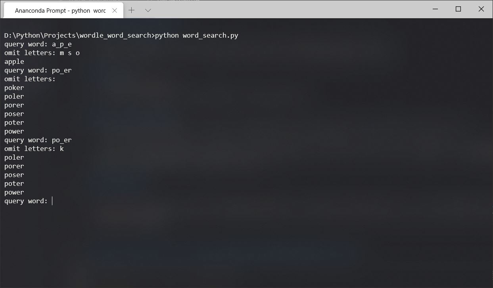

# Wordle Word Search

A python script to narrow down the word list while playing Wordle.

### To run
1. Clone this repo
2. Run in terminal using "python word_search.py"

### To search word
- Input the word with _ as blank character when terminal prompts with "query word: "

- Input omitting letters (letters not included in the result word) with space in between when terminal prompts with "omitting letters: "

### Example

### Word lists from: https://github.com/dwyl/english-words
